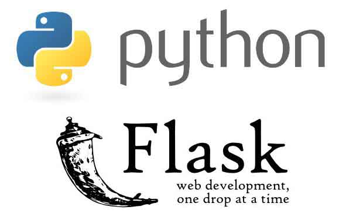

# flask-rest
A RESTful service based on the Flaks Python framework

<a href="http://flask.pocoo.org/"></a>

## Docker Container 

<a href="https://www.docker.com/what-docker"></a>

This setup requires Docker to run on your PC. I've used Windows and Powershell to run the commands. You can find the downloads for [Windows](https://www.docker.com/docker-windows) and [Mac](https://www.docker.com/docker-mac) at the respective links. 

The Create an image from the Flask service and run it and upload it as a web service, follow these steps:

## Before building the image

Please add a config.json file at the root of your project (same directory the Dockerfile is in) and give it the location of your model and actual model parameters. I've used [Azure Blob Storage](https://docs.microsoft.com/en-us/azure/storage/blobs/storage-blobs-introduction) for that:

```json
{
    "blob": {
        "account_name": "<STORAGE_NAME>",
        "account_key": "<STORAGE_KEY>"
        
    },
    "model": {
        "name": "<Model file name, e.g. knn_1.pkl>",
        "container": "<Name of the container that contains the model>"
    } 
}
```

*Currently, only models build with pickle or gzip compressed pickle models work. Specify the gzip compressed models with .gz at the end of the file name to load correctly.* 

## [Optional] To change the model and the pre-processing pipeline 

To change the model, you have to take notice of the following points:
- In [**modelHelper.py**](https://github.com/starlord-daniel/flask-rest/blob/ml-endpoint/api/modelHelper.py): import the library that was used to build the model, e.g. from sklearn.neighbors import KNeighborsClassifier
- In **requirements.txt**: Add the actual library as a requirement, if its not already satisfied
- In **Dockerfile**: If you use a library that uses additional packages, install them with: RUN apk add <package>

To change the pre-processing, you have to change the **process_image** method in [**modelHelper.py**](https://github.com/starlord-daniel/flask-rest/blob/ml-endpoint/api/modelHelper.py) and maybe create additional functions for better readability. Keep in mind that the output of this function is used as input to the model scoring function **label_and_prob** in [**modelHelper.py**](https://github.com/starlord-daniel/flask-rest/blob/ml-endpoint/api/modelHelper.py).

### Build the image by running:
```docker
docker build -t <image-name> .
```

Where -t is used to set the tag for the image to create. The dot (.) at the end refers to the file path of the Dockerfile. For the build to work, the whole path can't contain any spaces. Something like C:\test would be fine, but "C:\test\this app" wouldn't be.

An example: 

```docker
docker build -t flask-rest .
```

### Run the container locally:
```docker
docker run -p 8000:8000 <image-name>
```

The property -p sets the port mapping for the container. As the script exposes port 8000, this should be mapped to another port of the container. You might change the second value (right) to change the port to speak to. 

An example: 

```docker
docker run -p 8000:8000 flask-rest
```

### **[Option 1/2]** Upload image to Docker Hub:

1. Login to docker from command line

    ```docker
    docker login --username <docker-id> --password <docker-hub-password>
    ```

    It is more secure, to use --password-stdin to login to your docker account:

    ```docker
    $ cat ~/my_password.txt | docker login --username foo --password-stdin
    ```

    More information can be found in the [Docker Docs](https://docs.docker.com/engine/reference/commandline/login/#parent-command)

2. Push the image to Docker Hub:
    ```docker
    docker push <docker-id>/<name-of-image>:v1.0.0 .
    ```

### **[Option 2/2]** Upload image to Azure Container Registry

0. Prepare for upload:

    ```shell
    pip install --user azure-cli
    ```
    
    If this doesn't work, download the installer and follow the instructions up on [Azure Docs](https://docs.microsoft.com/en-us/cli/azure/install-azure-cli?view=azure-cli-latest)

1. Login to your container registry:

    ```docker 
    docker login <acr-name>.azurecr.io 
    ```

2. Push to your registry:

    ```docker 
    docker tag <image-name> <acr-name>.azurecr.io/<repo-name>
    docker push <acr-name>.azurecr.io/<repo-name>
    ```

    More info in the [Azure Docs](https://docs.microsoft.com/en-us/azure/container-registry/container-registry-get-started-docker-cli)

## Create a web service from your Docker image

Use the [Webapp for containers](https://azure.microsoft.com/en-us/services/app-service/containers/) to use the model from DockerHub or Azure Container Registry. You can find the documentation on the [Azure Documentation](https://docs.microsoft.com/en-us/azure/app-service/containers/) 

## Call the service

We exposed the **/pred** and **/predict** routes in the **main.py** file. It is quite straight-forward to add new routes by following the code. 

The call to the endpoint will look like this:

### Request Body: 
```json
{
    "image_url":"https://www.your-test-image.com/image.jpg"
}
```
### Request Url: 
Could be anything you publish it to, but for Azure Webapps it is in the format: **\<custom-name\>.azurewebsites.net/pred**